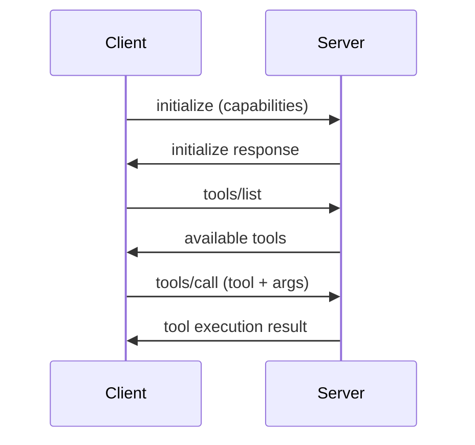

# Model Context Protocol (MCP) Integration

This Swift Semantic Kernel implementation includes comprehensive Model Context Protocol (MCP) support, enabling AI applications to interact with external tools and data sources through a standardized protocol.

## Overview

The Model Context Protocol (MCP) is an open standard that enables seamless integration between LLM applications and external systems. Our Swift implementation provides:

- **Full MCP Specification Compliance** (2024-11-05)
- **Multiple Server Implementations** with different security levels
- **Native Swift/SwiftUI Integration** for macOS and iOS
- **Production-Ready Security** with comprehensive threat prevention
- **Visual Demo Applications** showcasing real-world usage

## 🚀 Build Status (Verified: 2025-08-03)

All MCP components build and run successfully with Swift 6.0:

| Server | Build | Runtime | Features |
|--------|-------|---------|----------|
| `hello-mcp-server` | ✅ | ✅ | Basic protocol demo with 4 tools |
| `filesystem-mcp-server-basic` | ✅ | ✅ | Secure file operations with path allowlisting |
| `filesystem-mcp-server-jwt` | ✅ | ✅ | JWT authentication layer |
| `filesystem-mcp-server-oauth` | ✅ | ✅ | OAuth 2.1 + PKCE authentication |
| `mcp-filesystem-demo` | ✅ | ✅ | macOS SwiftUI demo application |

### Verified Functionality
- ✅ JSON-RPC 2.0 message handling
- ✅ Protocol version negotiation (2024-11-05)
- ✅ Tool discovery and listing
- ✅ Tool invocation with typed arguments
- ✅ Error handling with proper error codes
- ✅ Security controls (path validation, size limits)
- ✅ Streaming I/O via stdin/stdout

## Architecture

### Protocol Implementation

```swift
// Core MCP Protocol in Sources/MCPShared/
MCPProtocol.swift       // Protocol definitions and JSON-RPC handling
MCPFilesystemService.swift  // Filesystem operations service

// Server Implementations
hello-mcp-server/       // Basic demonstration server
filesystem-mcp-server-basic/  // Secure filesystem access
filesystem-mcp-server-jwt/    // JWT authentication variant
filesystem-mcp-server-oauth/  // OAuth 2.1 + PKCE variant
```

### Communication Flow



## 🚀 Quick Start

### Building MCP Servers

```bash
# Build all MCP components
swift build --product hello-mcp-server \
           --product filesystem-mcp-server-basic \
           --product filesystem-mcp-server-jwt \
           --product filesystem-mcp-server-oauth \
           --product mcp-filesystem-demo

# Or build individually
swift build --product hello-mcp-server
```

### Testing MCP Servers

```bash
# Test basic functionality
echo '{"jsonrpc": "2.0", "id": 1, "method": "tools/list"}' | .build/debug/hello-mcp-server

# Test tool execution
echo '{"jsonrpc": "2.0", "id": 2, "method": "tools/call", "params": {"name": "hello", "arguments": {"name": "Developer"}}}' | .build/debug/hello-mcp-server

# Test filesystem server (with security)
echo '{"jsonrpc": "2.0", "id": 1, "method": "tools/call", "params": {"name": "list_directory", "arguments": {"path": "~/Documents"}}}' | .build/debug/filesystem-mcp-server-basic
```

## Available MCP Servers

### 1. Hello MCP Server
**Purpose:** Learning and testing MCP protocol  
**Location:** `Sources/hello-mcp-server/`

```bash
# Build and run
swift build --product hello-mcp-server
swift run hello-mcp-server

# Test with sample request
echo '{"jsonrpc": "2.0", "id": 1, "method": "tools/list"}' | swift run hello-mcp-server
```

**Available Tools:**
- `hello` - Generate friendly greetings
- `echo` - Echo messages back
- `add` - Perform addition
- `get_time` - Get current timestamp

### 2. Filesystem MCP Server (Basic)
**Purpose:** Secure filesystem operations  
**Location:** `Sources/filesystem-mcp-server-basic/`

```bash
# Build and run
swift build --product filesystem-mcp-server-basic
swift run filesystem-mcp-server-basic
```

**Available Tools:**
- `read_file` - Read file contents (10MB limit)
- `write_file` - Write/create files
- `list_directory` - List directory contents
- `create_directory` - Create directories
- `get_file_info` - Get file metadata
- `search_files` - Search with patterns

**Security Features:**
- Path allowlisting (Documents, Desktop, Downloads, tmp)
- Directory traversal prevention
- File size limits
- Input sanitization

### 3. Filesystem MCP Server (JWT)
**Purpose:** Filesystem operations with JWT authentication  
**Location:** `Sources/filesystem-mcp-server-jwt/`

Enhanced security with:
- JWT token validation
- Expiration checking
- HMAC-SHA256 signatures
- Token refresh support

### 4. Filesystem MCP Server (OAuth)
**Purpose:** Filesystem operations with OAuth 2.1  
**Location:** `Sources/filesystem-mcp-server-oauth/`

Enterprise-grade security:
- OAuth 2.1 + PKCE flow
- Token management
- Refresh token support
- Secure state handling

## Integration Examples

### Claude Desktop Configuration

Add to `claude_desktop_config.json`:

```json
{
  "mcpServers": {
    "swift-filesystem": {
      "command": "/path/to/.build/debug/filesystem-mcp-server-basic"
    },
    "swift-hello": {
      "command": "swift",
      "args": ["run", "hello-mcp-server"],
      "cwd": "/path/to/swift-semantic-kernel"
    }
  }
}
```

### Programmatic Integration

```swift
import SemanticKernel
import MCPShared

// Create MCP-enabled kernel
var builder = KernelBuilder()
builder = await builder
    .withService(OpenAIChatCompletionService(apiKey: apiKey))
    .withMCPServer(url: "mcp://localhost:3000")
    
let kernel = await builder.build()

// Use MCP tools through natural language
let result = try await kernel.chatCompletion.process(
    prompt: "List all Swift files in the current directory",
    kernel: kernel
)
```

## Demo Applications

### macOS MCP Filesystem Demo

A complete macOS application demonstrating MCP integration:

```bash
swift run mcp-filesystem-demo
```

**Features:**
- Split-pane interface (file browser + operations)
- Real-time MCP operation visualization
- AI assistant integration via Semantic Kernel
- Native macOS design patterns

**Architecture:**
```
mcp-filesystem-demo/
├── MCPFilesystemDemoApp.swift    // App entry point
├── ContentView.swift              // Main split view
├── FileBrowserView.swift          // File navigation
├── MCPOperationsView.swift        // MCP operations panel
├── AIAssistantView.swift          // AI chat interface
└── MCPFilesystemViewModel.swift   // Business logic
```

## Security Model

### Defense in Depth

1. **Input Validation**
   - JSON schema validation
   - Type checking
   - Range validation
   - Pattern matching

2. **Path Security**
   - Allowlist-based access control
   - Path canonicalization
   - Symlink resolution
   - Directory traversal prevention

3. **Resource Limits**
   - File size limits (10MB)
   - Directory depth limits
   - Operation timeouts
   - Memory usage caps

4. **Error Handling**
   - Detailed error codes
   - Security logging
   - No sensitive data exposure
   - Graceful degradation

### Default Permissions

```
✅ Allowed Paths:
- ~/Documents
- ~/Desktop  
- ~/Downloads
- /tmp

❌ Restricted:
- System directories
- Hidden files (.*) 
- Network paths
- Parent directories (..)
```

## Development Guide

### Creating Custom MCP Servers

1. **Define Server Structure**
```swift
struct MyMCPServer {
    func run() async throws {
        // Read from stdin, write to stdout
    }
}
```

2. **Implement Message Handling**
```swift
func handleMessage(_ message: MCPMessage) async throws -> MCPResponse {
    switch message.method {
    case "initialize":
        return handleInitialize(message)
    case "tools/list":
        return handleToolsList()
    case "tools/call":
        return handleToolCall(message)
    default:
        throw MCPError.methodNotFound
    }
}
```

3. **Add Tool Definitions**
```swift
func handleToolsList() -> MCPResponse {
    return MCPResponse(result: [
        "tools": [
            [
                "name": "my_tool",
                "description": "Does something useful",
                "inputSchema": [
                    "type": "object",
                    "properties": [
                        "param": ["type": "string"]
                    ]
                ]
            ]
        ]
    ])
}
```

### Testing MCP Servers

```bash
# Protocol compliance test
./scripts/test-mcp-compliance.sh my-mcp-server

# Security test suite  
swift test --filter MCPSecurityTests

# Integration tests
swift test --filter MCPIntegrationTests
```

## Best Practices

### Security
- Always validate and sanitize inputs
- Use allowlists, not denylists
- Implement rate limiting
- Log security events
- Fail securely by default

### Performance
- Stream large responses
- Implement caching where appropriate
- Use async/await for I/O operations
- Monitor resource usage
- Profile performance regularly

### Reliability
- Handle disconnections gracefully
- Implement retry logic
- Validate protocol versions
- Use structured logging
- Monitor error rates

## Troubleshooting

### Common Issues

**Server not responding:**
```bash
# Check if server is running
ps aux | grep mcp-server

# Test with simple echo
echo '{"jsonrpc": "2.0", "id": 1, "method": "ping"}' | ./mcp-server
```

**Permission denied errors:**
```bash
# Check file permissions
ls -la ~/.build/debug/

# Make executable
chmod +x ~/.build/debug/mcp-server
```

**Protocol version mismatch:**
- Ensure client and server use same MCP version
- Check initialization handshake
- Verify capability negotiation

## Resources

- [MCP Specification](https://modelcontextprotocol.io/specification)
- [JSON-RPC 2.0](https://www.jsonrpc.org/specification)
- [Security Best Practices](Sources/filesystem-mcp-server-basic/README.md)
- [Example Implementations](Sources/hello-mcp-server/README.md)

## Contributing

When contributing MCP-related code:

1. Follow the MCP specification exactly
2. Add comprehensive security measures
3. Include thorough documentation
4. Write extensive tests
5. Consider backward compatibility

See [CONTRIBUTING.md](CONTRIBUTING.md) for general guidelines.